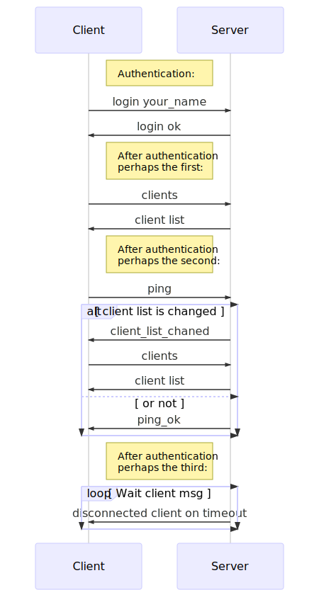

# Лабораторная работа №7

## Задание

Реализовать синхронный сервер с использованием [Boost.Asio](https://www.boost.org/doc/libs/1_68_0/doc/html/boost_asio.html). 
> **Boost.Asio** - кросс-платформенная **С++** библиотека для программирования сетевых приложений и других низкоуровневых программ ввода/вывода, которая абстрагирует понятия **input** и **output**, что позволяет делать их синхронными или асинхронными:
```cpp
read(stream, buffer [, extra options]);
async_read(stream, buffer [, extra options], handler);
write(stream, buffer [, extra options]);
async_write(stream, buffer [, extra options], handler);
```
#### Требуется:

1. Реализовать синхронный сервер, который должен содержать минимум два потока: один - для прослушивания новых клиентов, другой - для обработки существующих. <br/>Нельзя использовать один поток, так как ожидание нового клиента является блокирующей операцией.
2. На сервере требуется предусмотреть следующее: 
- клиент заходит на сервер с именем пользователя (без пароля);
- все соединения инициируются клиентом, где клиент запрашивает ответ от сервера;
- запросы и ответы на них заканчиваются символом `'\n'`; 
- сервер отключает любого клиента, который не отвечает (не пингуется) в течение **5** секунд;
- клиент может делать следующие запросы: получить список всех подключенных клиентов и пинговаться, где в ответе сервера будет либо `ping_ok`, либо `client_list_chaned` (в последнем случае клиент повторно запрашивает список подключенных клиентов);
- взаимодействие между клиентом и сервером осуществляется следующим образом:
<br/></img>
3. Тестирование сервера выполнить с помощью утилиты **curl** (документацию с примерами можно найти [здесь](https://ec.haxx.se/cmdline-options.html)).
4. При подключении клиента к серверу выполнить запись в **Log** параметров подключения (с временной меткой).
5. Для логгирования использовать библиотеку `boost::log` (документацию с примерами можно найти [здесь](https://www.boost.org/doc/libs/1_68_0/libs/log/doc/html/log/tutorial.html#log.tutorial.trivial)).
6. Обеспечить ротацию лог-файлов по размеру.

## Рекомендации

- Все синхронные функции имеют перегрузки выбрасывающие исключения в результате ошибки или возвращающие код ошибки с использованием `boost::system::system_error`:
```cpp
sync_func(arg_1, arg_2 ... arg_n);          // throws exception
boost::system::error_code error;
sync_func(arg_1, arg_2, ..., arg_n, error); // returns error code
```
Например:
```cpp
using boost::asio;
const ip::tcp::endpoint endpoint;
ip::tcp::socket socket{service};
socket.connect(endpoint);
boost::system::error_code error;
socket.connect(endpoint, error);
```
В данном фрагменте кода `socket.connect(endpoint)` выбрасывает исключение в случае ошибки, а `socket.connect(endpoint, error)` возвращает код ошибки. В синхронных функциях вы можете использовать как исключения так и коды ошибок, но пользуйтесь чем-то одним. Все коды ошибок `Boost.Asio` находятся в пространстве имен `boost::asio::error`.

- Синхронное чтение и запись в **TCP** сокет, например, может быть реализовано следующим образом:
```cpp
const ip::tcp::endpoint endpoint{ip::address::from_string("127.0.0.1"), 80};
ip::tcp::socket socket{service};
socket.connect(endpoint);
socket.write_some(buffer{"GET /index.html\r\n"});
std::cout << "bytes available " << socket.available() << std::endl;
char data[512];
size_t read_bytes = socket.read_some(buffer{data});
```

- Простая реализация синхронного сервера может иметь следующий вид:
```cpp
void accept_thread() {
    ip::tcp::acceptor acceptor{service, ip::tcp::endpoint{ip::tcp::v4{}, 8001}};
    while (true) {
        auto client = std::make_shared<talk_to_client>(); // talk_to_client - user defined class
        acceptor.accept(client->sock());
        boost::recursive_mutex::scoped_lock lock{mutex};
        clients.push_back(client);
    }
}

void handle_clients_thread() {
    while (true) {
        std::this_thread::sleep(std::chrono::milliseconds{1});
        boost::recursive_mutex::scoped_lock lock{mutex};
        for (auto& client : clients) {
            // for each client calling answer_to_client();
        }
        // and then erase clients that timed out
      }
}

int main(int /*argc*/, char* /*argv*/[]) {

    boost::thread_group threads;
    threads.create_thread(accept_thread);
    threads.create_thread(handle_clients_thread);
    threads.join_all();
}
```
